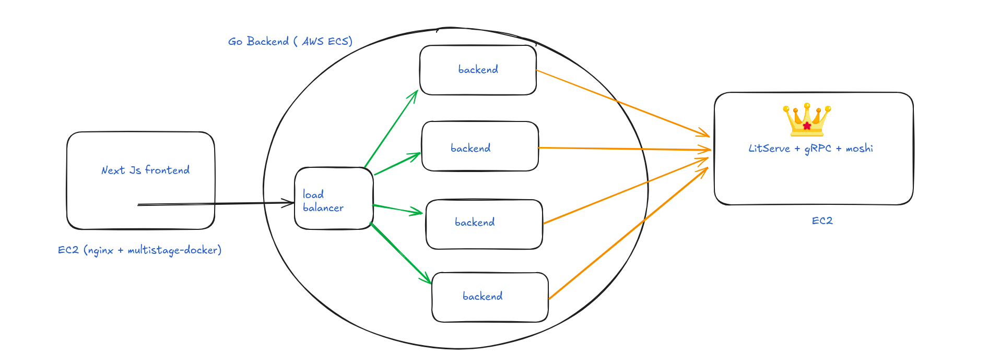
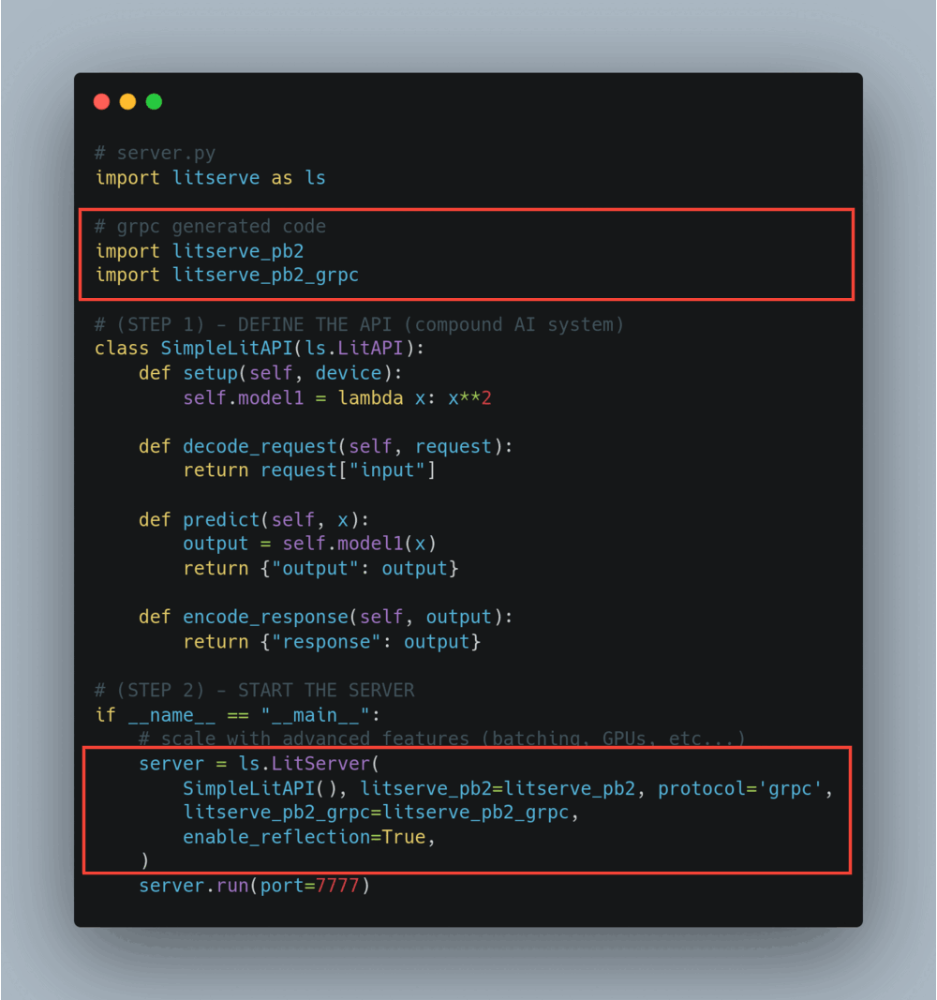
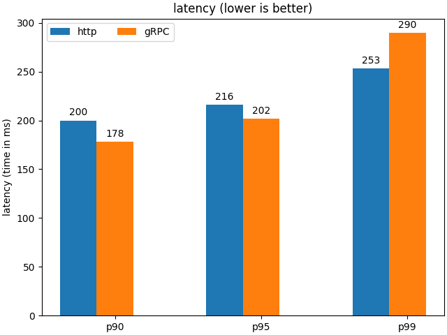
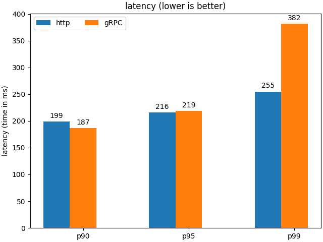
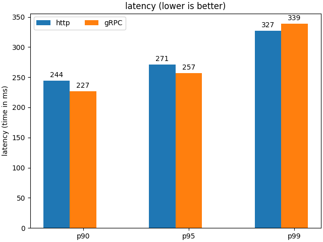
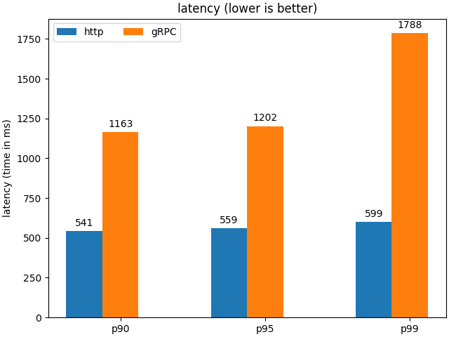
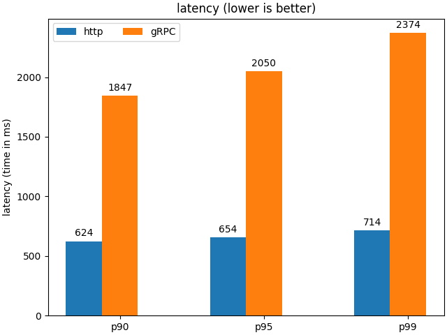
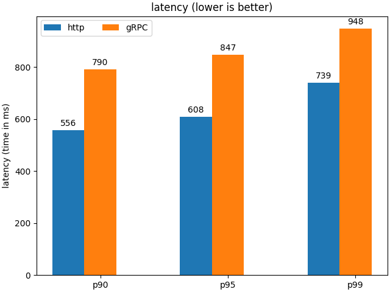
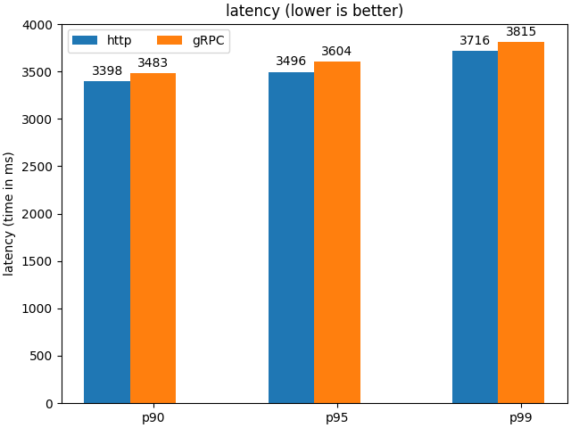

# Lightning Moshi

[output.webm](https://github.com/user-attachments/assets/726228cc-82f4-4426-92ca-7e9b314f885c)

---

## Idea



- Extend the [litserve](https://github.com/lightning-ai/litserve) to support grpc
- Create a project to talk with a speech-to-speech model moshi
- Deploy the project to AWS:
    - **frontend**: AWS EC2 instance
    - **backend**: AWS ECS (to autoscale)
    - **grpc litserve model**: AWS EC2

- [Checkout the LitServe fork with grpc support](./LitServe_with_grpc/)

---

## Tech Stack

- [Litserve](https://github.com/lightning-ai/litserve)
- [Next.js](https://nextjs.org/)
- [Tailwind CSS](https://tailwindcss.com/)
- [NextUI](https://nextui.org/)
- [Aceternity](https://ui.aceternity.com/)
- [Go fiber](https://gofiber.io/)
- [Protobuf](https://protobuf.dev/)
- [gRPC](https://grpc.io/)
- [MongoDB](https://www.mongodb.com/)
- [Pytorch Torchaudio](https://pytorch.org/audio/stable/index.html)
- [Moshi (a 7.69 billion speech-speech model)](https://huggingface.co/kyutai/moshiko-pytorch-bf16)

---

## Using LitServe with gRPC

1. Generate the proto file

```bash
litserve generate_protobuf
```

2. Modify the proto file according to your needs
3. Generate the python grpc server code (`litserve command helps`)
4. Just import in your litserve server and pass to the `LitServer` class



---

## BenchMarks

- [Checkout the benchmark code & results](./benchmark-litserve-grpc/) (go client & python server)

- Unfortunately, the gRPC server couldn't outperform the HTTP server.

But, anyways, here're the results:

- For a single field json `{"text": "hello"}`




- For json with 5 fields



- For json with 100 fields



- for image `(grpc underperforms http by a lot)`



- for audio file `(almost 3x slower than http, god!)`



---

## Benchmarks for `streaming text` & `bytes`

- Streaming text



- Streaming bytes



---

## Thank You 🙏

Thank you for taking the time to check out this project!

- I hope you find it useful and insightful. If you have any feedback, feel free to open an issue or contribute.

- 🚀 I'm currently open to full-time opportunities!

- If you're looking for a passionate developer with experience in Go, Python, AI/ML infrastructure, and distributed systems, feel free to reach out. I'd love to contribute my skills to a team working on exciting projects!
